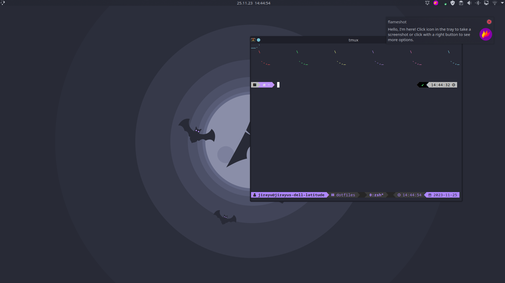

# JirR02 Dotfiles

## Table of Contents

1. [What are Dotfiles?](#what-are-dotfiles)
1. [How to manage your own Dotfiles?](#how-to-manage-your-own-dotfiles)
1. [License](#license)

## What are Dotfiles?

Dotfiles are configuration files for various programs, and they help those programs manage their functionality. What sets them apart from regular files and directories is their prefix. Dotfiles are named that way because each file and directory starts with a dot. On Unix based systems, dotfiles are hidden by the Operating System by default.

## How to manage your own Dotfiles?

To manage my Dotfiles I use a git bare repository. If you are interested in my method go check out [https://www.youtube.com/watch?v=tBoLDpTWVOM&t=746s](DistroTube's video) on it.

## License

This program is free software: you can redistribute it and/or modify it under the terms of the GNU General Public License as published by the Free Software Foundation.
